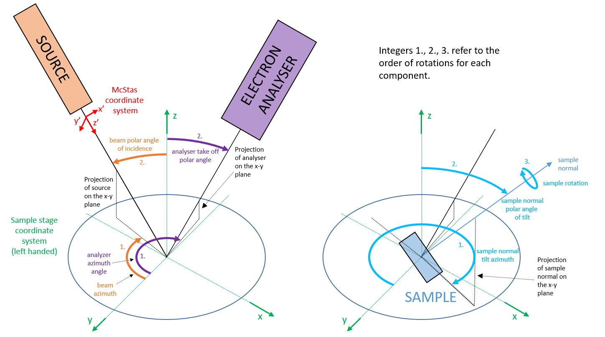

# The XPS coordinate system
The application definition [NXxps](https://fairmat-nfdi.github.io/nexus_definitions/classes/contributed_definitions/NXxps.html) defines a coordinate system based on the sample stage, which is the same coordinate system as in the [ISO standard](https://www.iso.org/standard/24269.html) for surface chemical analysis.



An example for this coordinate system can be found [here](https://github.com/FAIRmat-NFDI/pynxtools-xps/tree/main/examples/coordinate_system).

The file `config_vms_cs_fixed.json` contains a hard-coded measurement configuration, which was translated to `NXxps` using the following command:

```console
user@box:~$ dataconverter config_vms_cs_fixed.json --reader xps --nxdl NXxps --ignore-undocumented --output vms-cs-fixed.nxs 
```

The file `vms-cs.glb` contains a 3D representation (in [gltf/glb](https://en.wikipedia.org/wiki/GlTF) format) of the NXtransformation matrices in the NeXus file. It was created using the [nexus3d tool](https://github.com/domna/nexus3d) with the following command (using the [STL](<https://en.wikipedia.org/wiki/STL_(file_format)>) objects located in the `shapes/` subfolder):

```console
user@box:~$ pip install nexus3d
user@box:~$ python shapes/shapes.py
user@box:~$ nexus3d vms-cs-fixed.nxs -fo vms-cs.glb --blender -c config-stl.json -s 1
```

