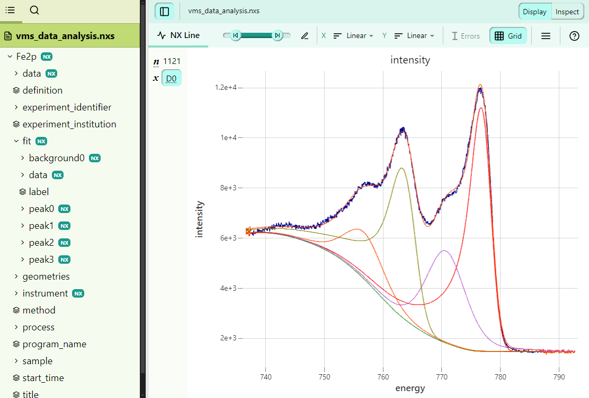

# Data processing with CasaXPS

```pynxtools-xps``` supports extracting data and the description of the data analysis (i.e., peak fitting)
by the [CasaXPS data analysis software](http://www.casaxps.com/).

## Modeling of peak fitting in CasaXPS

This is a short description of how peak models are implemented in CasaXPS. The user is referred to the [CasaXPS web site](http://www.casaxps.com/) for a more accurate and detailed explanation.

CasaXPS models peak fitting using two concepts: **regions** and **components**. Regions define the energy range
that is used for peak fitting as well as the background shape to be used. Many different background shapes are
available in CasaXPS, including the most commonly used linear, Shirley, and Tougaard backgrounds. Each peak model is made up of several components, each of which model a single chemical species. Components can have many different line shapes. Constraints with respect to the total area, full-width at half maximum, and position on the energy axis can be defined as well, also with respect to any of the other components.

## Modeling of data fitting in NeXus

NeXus contains a base class for modelling fit procedures called [`NXfit`](https://fairmat-nfdi.github.io/nexus_definitions/classes/contributed_definitions/NXfit.html). ``NXfit`` contains

- the data to be modelled
- one or more instances of [`NXpeak`](https://fairmat-nfdi.github.io/nexus_definitions/classes/contributed_definitions/NXpeak.html) to define individual peaks in the model. These map to the components in
CasaXPS
- one or more instances of [`NXfit_background`](https://fairmat-nfdi.github.io/nexus_definitions/classes/contributed_definitions/NXfit_background.html) to define the background to be subtracted during the fit. These map to the regions in CasaXPS.
- two instances of [`NXfit_function`](https://fairmat-nfdi.github.io/nexus_definitions/classes/contributed_definitions/NXfit_function.html) to describe the function used for the global fit (`global_fit_function`) and for the optimization (`error_function`).
- information about the fitting envelope and the residual of the fit

The application definition `NXxps` implements an [`NXfit` group](https://fairmat-nfdi.github.io/nexus_definitions/classes/contributed_definitions/NXxps.html#nxxps-entry-fit-group) to model peak fitting in XPS. Aside from the terms defined in the base class `NXfit`, it also contains some information more specific to XPS fits, like the atomic concentration of each species in the fit model.

## How-to convert peak fitting in CasaXPS into a NeXus file

```pynxtools-xps``` can extract the definition of the peak fitting parameters and store them in an HDF5 file compliant with the `NXxps` application definition.

Three files are needed for the example conversion:

1) The VAMAS (.vms) file containing the original (meta)data and the definition of the peak fitting in the VAMAS
comments
2) The lineshapes of the measurement data as well as the peak fitting, exported from CasaXPS as a TXT file.
This file can be obtained by using the `Save Tab ASCII` to TXT button in CasaXPS and choosing "Rows of Tables" as the export option.
3) The analysis results (incl. the atomic concentrations), exported from CasaXPS as a CSV file. This file can be obtained from the `Quantify` window in CasaXPS and exporting the "Comps" report from the "Report" tab. You can learn more about XPS quantification in CasaXPS [here](http://www.casaxps.com/casaxps-training/quantification/quant.htm).

You can have a look a the example conversion to understand which exported files are expected for the data reader to work.

## Example conversion
See [here](../reference/vms.md#data-analysis-and-peak-fitting) for an example of converting VAMAS data containing
data analysis results from CasaXPS. The resulting file looks like this:


