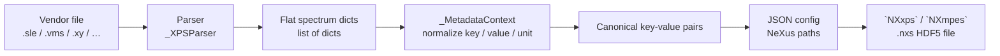

# Parser architecture

## Software architecture

Mapping between vendor-specific representations and community-agreed data models is a central challenge in research data management. `pynxtools-xps` solves this for X-ray photoelectron spectroscopy through a three-layer pipeline: **parsing**, **metadata normalization**, and **template mapping**.

The implementation is organized in three explicit layers, each with a clearly bounded responsibility:

1. **Parsing** — vendor-specific
   [`_XPSParser`](https://github.com/FAIRmat-NFDI/pynxtools-xps/blob/main/src/pynxtools_xps/parsers/base.py)
   subclasses extract spectra from raw files into flat dictionaries.
2. **Normalization** — per-vendor
   [`_MetadataContext`](https://github.com/FAIRmat-NFDI/pynxtools-xps/blob/main/src/pynxtools_xps/mapping.py)
   instances canonicalize key names, values, and units through a deterministic pipeline.
3. **Templating** — JSON config files map canonical keys to NeXus paths in `NXxps` or `NXmpes`, which `XPSReader` uses to write the HDF5 output.

This separation keeps all vendor-specific knowledge confined to
[`parsers/<vendor>/`](https://github.com/FAIRmat-NFDI/pynxtools-xps/tree/main/src/pynxtools_xps/parsers) subpackages and makes the normalization logic independently testable.



---

## Layer 1 — File parsing

Each supported format has a dedicated parser in
[`src/pynxtools_xps/parsers/<vendor>/parser.py`](https://github.com/FAIRmat-NFDI/pynxtools-xps/tree/main/src/pynxtools_xps/parsers).

### Parser hierarchy

All parsers inherit from
[`_Parser`](https://github.com/FAIRmat-NFDI/pynxtools-xps/blob/main/src/pynxtools_xps/parsers/base.py),
the abstract base class that defines the extension, version, and structure validation contract.
Two concrete base classes specialize it:

- [`_XPSParser`](https://github.com/FAIRmat-NFDI/pynxtools-xps/blob/main/src/pynxtools_xps/parsers/base.py)
  — primary data parsers. Subclasses implement `matches_file()` (structural validation)
  and `_parse()` (data extraction).
- [`_XPSMetadataParser`](https://github.com/FAIRmat-NFDI/pynxtools-xps/blob/main/src/pynxtools_xps/parsers/base.py)
  — supplementary parsers for auxiliary files (for example, CasaXPS quantification exports).
  They inject additional metadata into already-parsed data via `update_main_file_data()`.

### Output format

Every `_XPSParser` populates `self._data`, a `list[dict[str, Any]]`. Each dictionary
represents one XPS spectrum and contains all raw key-value pairs extracted from the file.
Key names and value formats are vendor-specific at this stage.

### Version awareness

Parsers that need to constrain which file versions they accept declare `supported_versions`:

```python
supported_versions = (
    ((1, 1), (4, 0)),   # [1.1, 4.0)
    ((4, 1), (4, 101)), # [4.1, 4.101)
)
```

Intervals are half-open: the lower bound is inclusive, the upper bound exclusive.
A `None` upper bound means unbounded (`>= lower`).

When `supported_versions` is empty (the default), all files are accepted regardless
of whether they carry a version string. When non-empty, files without a version are
implicitly rejected — a declared range implies a version is required.

Version strings extracted from file headers are tokenized into comparable `VersionTuple`
objects by
[`normalize_version`](https://github.com/FAIRmat-NFDI/pynxtools-xps/blob/main/src/pynxtools_xps/parsers/versioning.py)
before the range check.

---

## Layer 2 — Metadata normalization

Raw key-value pairs differ in naming, unit encoding, and value representation across
vendors.
[`_MetadataContext`](https://github.com/FAIRmat-NFDI/pynxtools-xps/blob/main/src/pynxtools_xps/mapping.py)
is a stateless normalization engine that converts a `(key, value)` pair into a canonical `(key, value, unit)` triple through a fixed pipeline.

### Normalization pipeline

Each step in `_MetadataContext.format(key, value)` runs in a fixed order:

| Step | What it does |
| ---- | ------------ |
| 1. `normalize_key` | Look up `key_map`; fall back to PascalCase → snake_case conversion |
| 2. `parse_value_and_unit` | Split inline value+unit strings, e.g. `"5.0 eV"` → `("5.0", "eV")` |
| 3. `resolve_unit_from_key` | Extract unit embedded in key, e.g. `"energy [eV]"` → key `"energy"`, unit `"eV"` |
| 4. `get_default_unit` | Assign unit from `default_units` if none found yet |
| 5. `map_unit` | Normalize abbreviations via `unit_map`, e.g. `"s-1"` → `"1/s"`, `"norm"` → `None` |
| 6. `map_value` | Apply converter functions from `value_map`, e.g. `_convert_energy_scan_mode` |
| 7. `_format_value` | Coerce numeric strings to `int` or `float` |

### Per-vendor contexts

Each vendor subpackage defines a module-level `_context` instance in
`parsers/<vendor>/metadata.py`:

```python
_context = _MetadataContext(
    key_map=_KEY_MAP,           # vendor key → canonical name
    value_map=_VALUE_MAP,       # canonical key → converter function
    unit_map=_UNIT_MAP,         # vendor unit string → standard unit
    default_units=_DEFAULT_UNITS,  # canonical key → unit when not stated explicitly
)
```

The shared converter functions (such as `_convert_measurement_method` and
`_convert_energy_scan_mode`) live in
[`mapping.py`](https://github.com/FAIRmat-NFDI/pynxtools-xps/blob/main/src/pynxtools_xps/mapping.py)
and are reused across all vendor contexts.

---

## Layer 3 — Template mapping

After normalization, the canonical key-value pairs are written into a NeXus template using
the parser's JSON config file in
[`src/pynxtools_xps/config/`](https://github.com/FAIRmat-NFDI/pynxtools-xps/tree/main/src/pynxtools_xps/config).
The config maps flat dict keys to paths in the target application definition:

```json
"/ENTRY[entry]/instrument/analyser/pass_energy": "pass_energy"
```

Learn more about these config files in the `pynxtools` documentation: [pynxtools > Learn > ... > The MultiFormatReader](https://fairmat-nfdi.github.io/pynxtools/learn/pynxtools/multi-format-reader.html#parsing-the-config-file){:target="_blank" rel="noopener"}.

`XPSReader` (the pynxtools reader plugin), which is a subclass of the `pynxtools` `MultiFormatReader`, uses this config to fill the template, merges in ELN-provided metadata for any required fields absent from the raw data, and writes the final `.nxs` HDF5 file via the pynxtools `dataconverter`.

The supported application definitions are:

- [`NXxps`](https://fairmat-nfdi.github.io/nexus_definitions/classes/applications/NXxps.html)
  — the primary target, specialized for X-ray photoelectron spectroscopy
- [`NXmpes`](https://fairmat-nfdi.github.io/nexus_definitions/classes/applications/NXmpes.html)
  — the multi-technique photoemission superset

---

## Typed intermediate representation

Intermediate data objects used during parsing inherit from
[`_XPSDataclass`](https://github.com/FAIRmat-NFDI/pynxtools-xps/blob/main/src/pynxtools_xps/parsers/base.py),
a base class that enforces type annotations at assignment time.
It coerces compatible values (for example, `str` → `int`) and raises `TypeError` for
values that cannot be converted, keeping parsing logic free of ad-hoc type guards.
